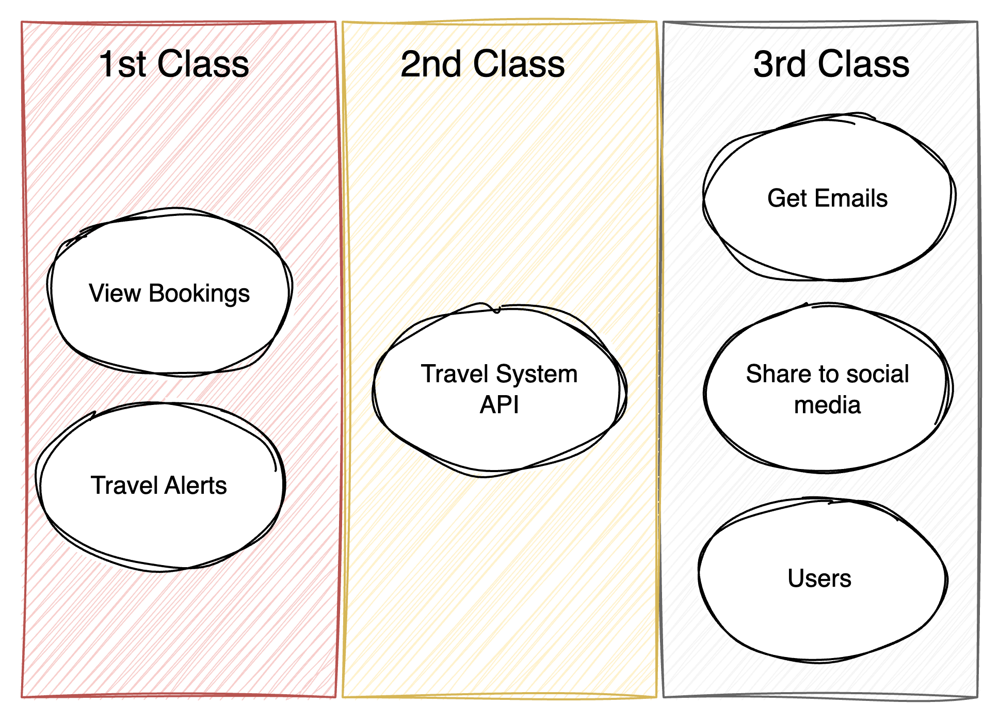

# Context
We have a business requirement that wants to guarantee no more than 5 minutes of downtime per month. Additionally, we expect surges of traffic during major travel disruptions in events such as natural disasters, airport communication issues causing flight delays etc.

# Decision
Any component of a system can be made scalable & elastic but in a large system we have to choose where we invest our efforts. We conducted an analysis an identified specific critical paths that we will invest the extra cost and effort to make scalable and elastic

Viewing bookings and receiving travel alerts have been as the main user journeys we need to guarantee uptime of. The Travel System API is inherently linked with alerts so that will need some extra considerations as well. Everything else will follow a standard set of service replication that balances cost & effort with the significance of downtime.

# Consequences
- We guarantee the essentials for completing a trip are available to users and meet the business' uptime goal.
- We are not overspending time and budget on areas of the Road Warrior where downtime is not preventing users from using the app effectively long-term.
