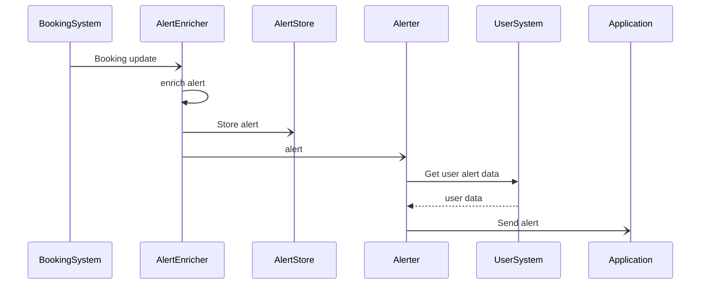
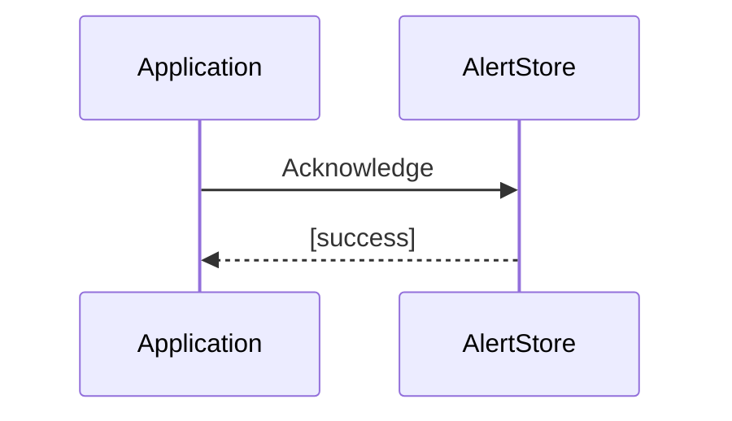

## Alerting
Alerts are sent when an asynchronous event indicating an update or delete is received from the BookingSystem. The AlertEnricher adds further information to the alert before it is saved and sent to the Alerter. The Alerter sends the event to the application layer based on the user's preferences. E.g., if the user has disabled push notifications the alert could be suppressed.

The alert is fired on asynchronous call from the Booking System because the alert should only be fired after the booking has been updated in the booking store. This avoids the user receiving an alert but the app not showing any changes.

### Sequence diagram
#### Booking update

#### User acknowledges alert
