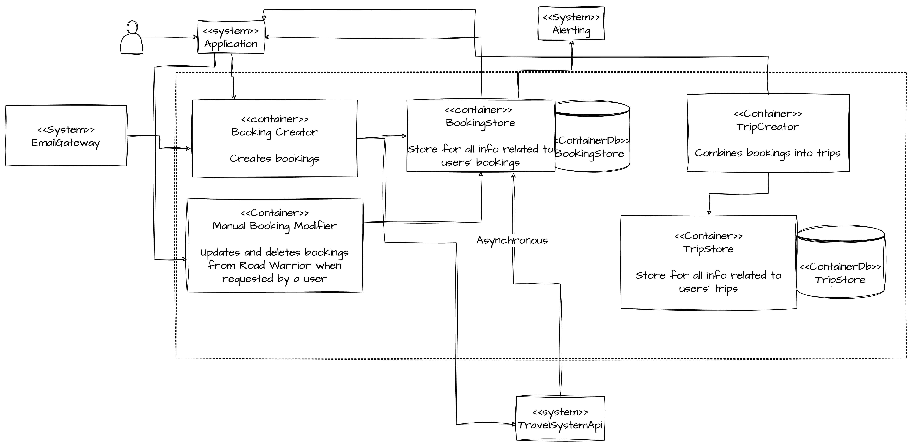

## Booking System
Bookings can be added to RoadWarrior in the following ways:

1. an email is sent to RoadWarrior containing a booking number
2. a user manually adds a booking number to RoadWarrior

In either case, the booking is sent to BookingCreator then verified using TravelSystemApi. Once verified it is added to the BookingStore (which should trigger an event that a booking has been added).

Once added, TravelSystemApi can tell the booking system when a booking has changed. A booking modification event from the TravelSystemApi must send an alert to the Alert System so the user can be made aware of a change to their booking they may not have made themselves.

The user can manually modify a booking via ManualBookingModifier. The event from booking store in this case should indicate that an alert does not need to be sent as the user has made the change themselves.

