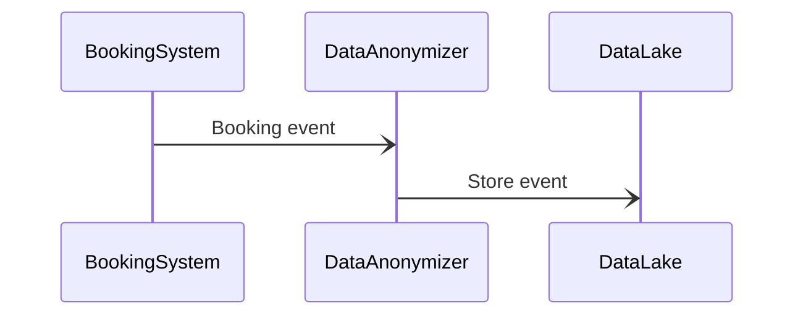
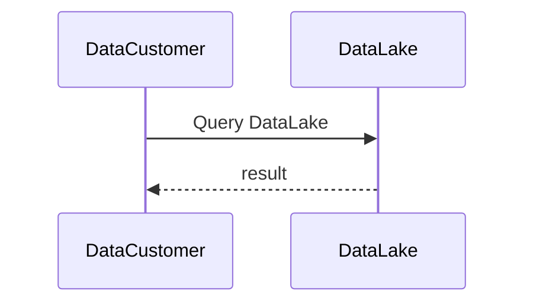
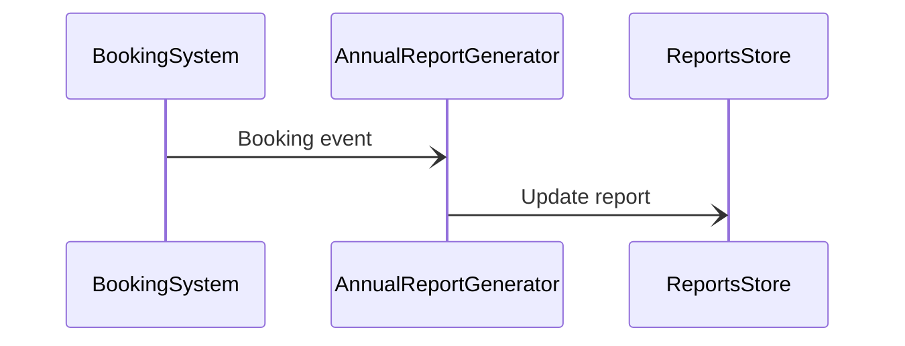
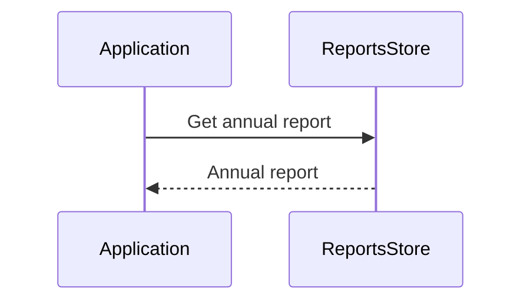

## Data Analytics
The data analytics system listens for events from the booking system. A booking will only be considered as data after it has been saved to the booking storage. Once received, it is sent to two containers:

1. Data Lake, via Data Anonymizer. The data is anonymized then saved. The data lake is made available to data customers (for money)
2. Annual Report generator. The trip is added to a user's annual report and saved into the report store. It can then be accessed from the application layer by a user.

The data lake holds all the aggregate and anonymized data that RoadWarrior sells to 3rd parties.

The reports store is added to whenever there is an event published that indicates a booking has been modified.

### Sequence Diagrams
#### Store booking event in data lake

#### Data customer queries data lake

#### Add booking event to report

#### User views annual report
