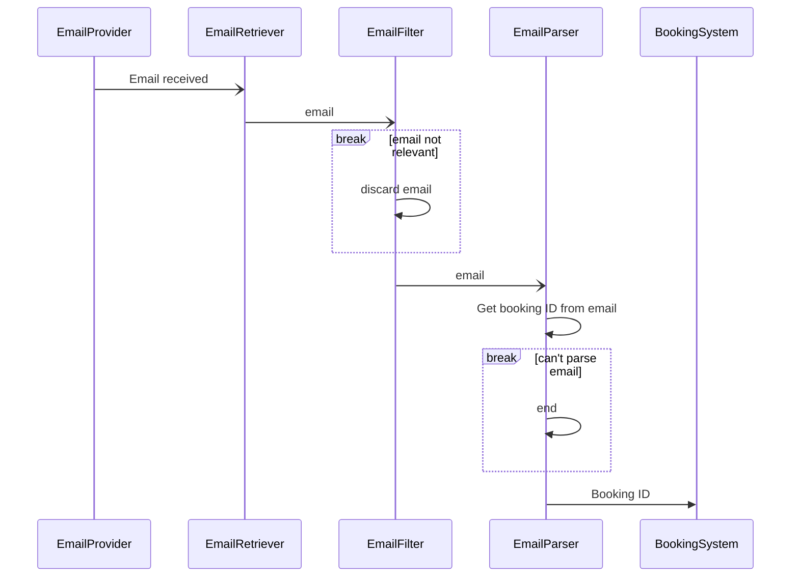
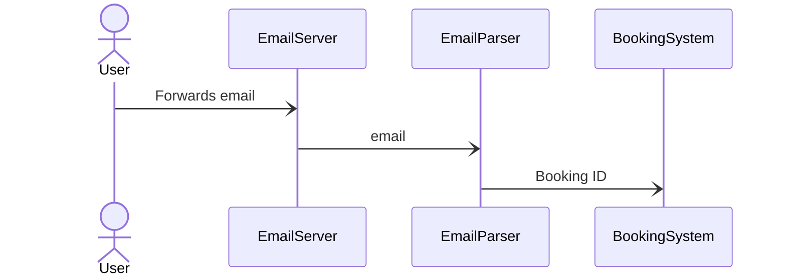

## Email System
The Email System parses a users emails for a booking and sends it to the booking system to be stored. It supports adding bookings only, update and deletions come from user input or updates from the travel system API.

An email is ingested by the system in the following ways:

1. The user forwards an email to the email server. The email is then parsed and the booking stored in the booking system.
2. The email is scraped from the user's specified email provider. All emails will be streamed into RoadWarrior and anything non-pertinent will be discarded.

The EmailProviderKey store holds authentication credentials to access the user's email provider.

### Sequence diagrams
#### Email retrieved from EmailProvider

\* if a booking confirmation email is detected but can't be parsed, do nothing

#### Email forwarded to RoadWarrior by user
