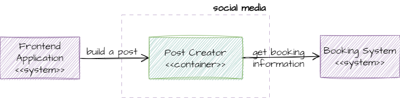
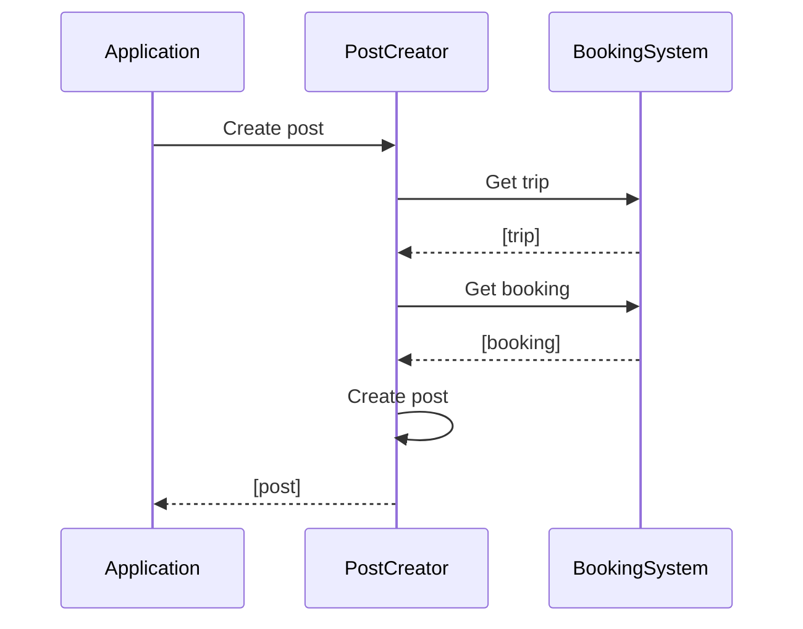

## Social Media
The PostCreator receives a request by the application to create a post. This is handled in RoadWarrior, instead of on the user's device so more booking and trip information than may be available on the device can be used to write the post.

### Sequence diagram
#### User shares booking or trip
