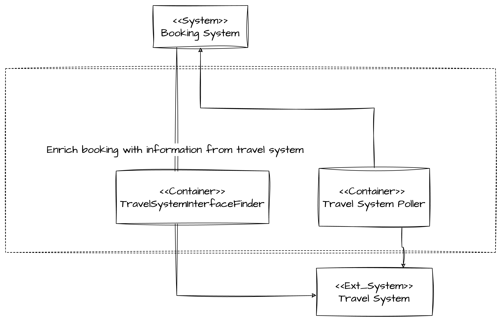

## Travel System API
The travel system poller queries the external travel system API for changes to bookings. For the MVP, one travel system will be supported but our choice of architecture allows us to extend and support more in future.

If an update is found it is reported back to the booking store and once updated, an event is fired into the rest of the application.

TravelSystemInterfaceFinder queries the travel system when a booking is added. This verifies the booking can be found in the travel system and allows for the booking to be enriched with more information that can't be derived from the booking number, e.g., seat number, departure times, etc.

