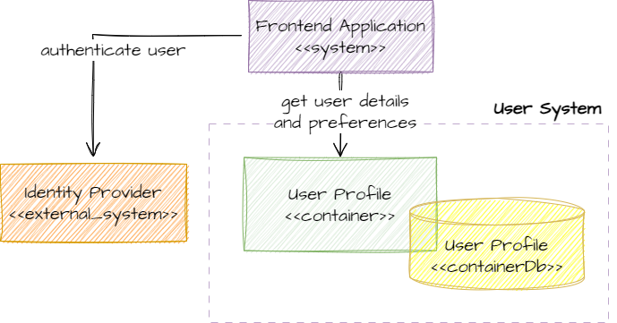

## User System
The user is authenticated using an external identity provider.

The user's profile is stored to hold user's application preferences and information. E.g., name, email, phone number, notification preferences, etc.

