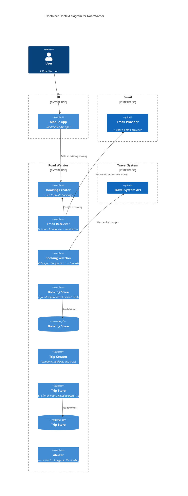

```mermaid
C4Context
    title Container Context diagram for RoadWarrior

    Person(user, "User", "A RoadWarrior")

    Enterprise_Boundary(ui, "UI") {
        Container(mobileApp, "Mobile App", "Android or iOS app")
    }

    Enterprise_Boundary(email, "Email") {
        System(emailProvider, "Email Provider", "A user's email provider")
    }

    Enterprise_Boundary(roadWarrior, "Road Warrior") {
        Container(bookingCreator, "Booking Creator", "Used to create bookings")

        Container(emailRetriever, "Email Retriever", "Gets emails from a user's email provider")

        Container(bookingWatcher, "Booking Watcher", "Watches for changes in a user's booking")

        Container(bookingStore, "Booking Store", "Store for all info related to users' bookings")
        ContainerDb(bookingStoreDb, "Booking Store")

        Container(tripCreator, "Trip Creator", "combines bookings into trips")

        Container(tripStore, "Trip Store", "Store for all infor related to users' trips")
        ContainerDb(tripStoreDb, "Trip Store")

        Container(alerter, "Alerter", "Alerts users to changes in the bookings")
    }

    Enterprise_Boundary(travelSystem, "Travel System") {
        System(travelSystemApi, "Travel System API")
    }

    Rel(user, mobileApp, "Uses")
    Rel(emailRetriever, emailProvider, "Gets emails related to bookings")
    Rel(emailRetriever, bookingCreator, "Creates a booking")
    Rel(mobileApp, bookingCreator, "Adds an existing booking")

    Rel(bookingWatcher, travelSystemApi, "Watches for changes")

    Rel(bookingStore, bookingStoreDb, "Reads/Writes")
    Rel(tripStore, tripStoreDb, "Reads/Writes")


    UpdateLayoutConfig($c4ShapeInRow="3", $c4BoundaryInRow="2")

```