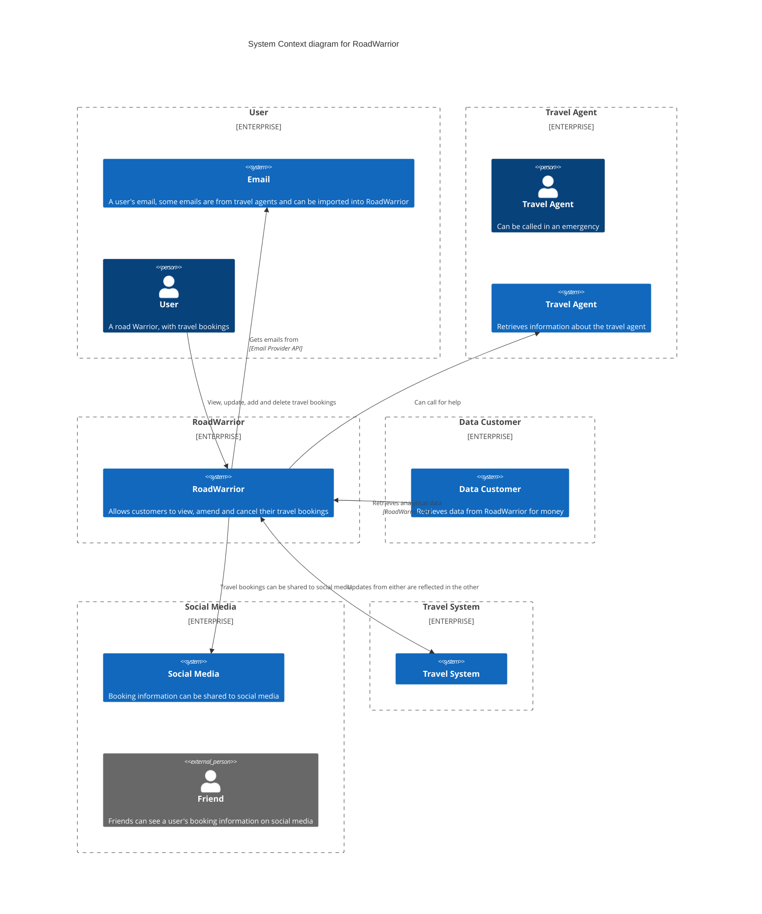

```mermaid
C4Context
    title System Context diagram for RoadWarrior

    Enterprise_Boundary(userBoundary, "User") {
        System(email, "Email", "A user's email, some emails are from travel agents and can be imported into RoadWarrior")

        Person(user, "User", "A road Warrior, with travel bookings")

    }

    Enterprise_Boundary(travelAgentBoundary, "Travel Agent") {

        Person(travelAgentPerson, "Travel Agent", "Can be called in an emergency")

        System(travelAgentSystem, "Travel Agent", "Retrieves information about the travel agent")
    }

    Enterprise_Boundary(RoadWarriorBoundary, "RoadWarrior") {

        System(RoadWarrior, "RoadWarrior", "Allows customers to view, amend and cancel their travel bookings")
    }

    Enterprise_Boundary(dataCustomerBoundary, "Data Customer") {

        System(dataCustomer, "Data Customer", "Retrieves data from RoadWarrior for money")
    }

    Enterprise_Boundary(socialMediaBoundary, "Social Media") {

        System(socialMedia, "Social Media", "Booking information can be shared to social media")

        Person_Ext(socialMediaFriend, "Friend", "Friends can see a user's booking information on social media")
    }


    Enterprise_Boundary(travelSystemBoundary, "Travel System") {

        System(travelSystem, "Travel System")
    }


    Rel(RoadWarrior, email, "Gets emails from", "Email Provider API")
    Rel(dataCustomer, RoadWarrior, "Retrieves analytical data", "RoadWarrior API")
    Rel(user, RoadWarrior, "View, update, add and delete travel bookings")

    BiRel(RoadWarrior, travelSystem, "Updates from either are reflected in the other")

    Rel(RoadWarrior, travelAgentSystem, "Can call for help")

    Rel(RoadWarrior, socialMedia, "Travel bookings can be shared to social media")
```