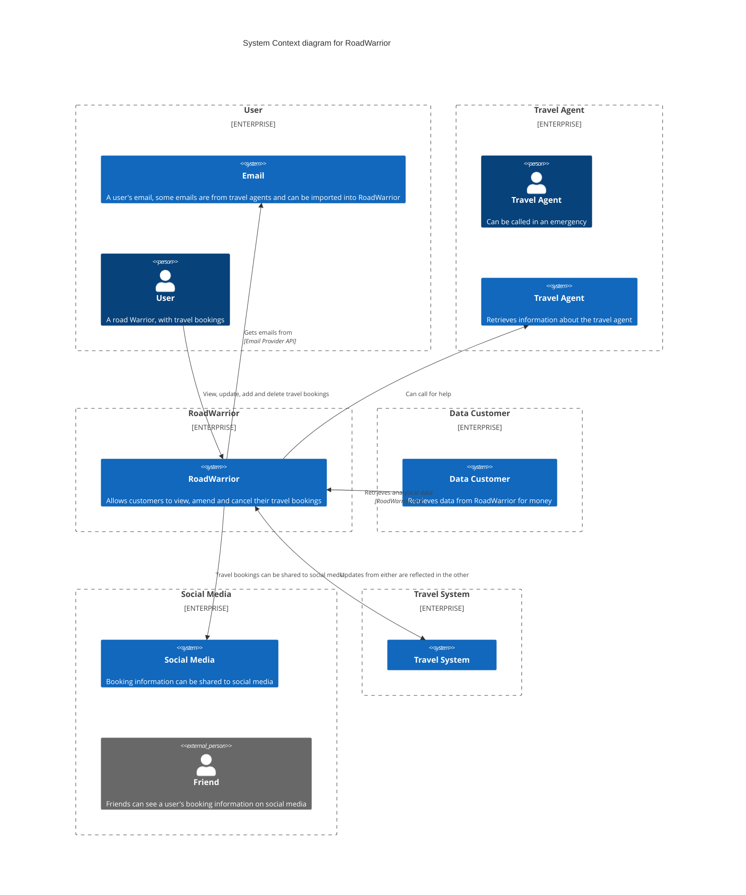

# flexibility-fertilisers
A high level view of the various systems and personas involved in interacting with Road Warrior

## Architectural Characteristics

Following the requirements and additional context, we assessed different architectural characteristics that are of main concern to the Road Warrior architecture.

| Characteristic |  Notes |
|--------|----|
| Availability | The system has strict downtime requirements of a maximum of 5 minutes a month. This is especially important for parts of the system that handle adding or updating travel details. |
| Reliability | The system must reliably add and update travel details. Missing updates could negatively impact the user's travel experience and have negative effects on user retention. |
| Elasticity  | Travel suffers from disruption in which case the system becomes even more important to its users wanting to keep on top of travel updates. In these instances, a surge in demand is expected and the system needs to be able to handle this gracefully and without impact to performance.
| Extensibility | The system integrates with various 3rd party travel and booking systems. Evolving with existing interfaces and adding new ones will be crucial to providing users the best possible set of details about their trips.  |

The following are characteristics that where considered relevant to the application but can be addressed through design and common practice.

| Characteristic |  Notes |
|--------|----|
| Localization | The application should be available internationally, which helps us support availability through multiple deployment locations. Different languages can be made available through design. |
| Installability | The system is accessible through a mobile app and website. To reach as many users as possible the app should be easy to install. This is well supported through different Application stores already.  |
| Privacy  | The system handles peoples' travel information which is personal and sensitive data. Identifiable data must therefore be kept private while an anonymized version must be accessible for data analytics. |
| Archivibility | The business model includes income to be derived from analytics run on user data. To make this successful, data needs to be retained and available to use for report creation. |

## Workflows

To identify the main components of the Road Warrior, we looked at the main workflows the system needs to support.

- User adds a booking through UI
    - System retrieves further details for booking
    - System displays full booking details in UI
    - The user combines bookings into a trip
    - System propagates new book and drip to data analytics

- User received email about a new booking
-   - User forwards email
    - System notices email
    - System retrieves further details about booking
    - System displays full booking details on UI
    - The user combines bookings into a trip
    - System propagates new book and drip to data analytics

- Flight is delayed
    - System receives update about the flight change
    - User is informed of change through UI
    - Change is propagated to data analytics

## Container Diagram

This diagram shows the interactions of the various parts of the RoadWarrior system at a very high level. It indicates the flow through the RoadWarrior application rather than define the individual containers which are specified in narrower diagrams below.
