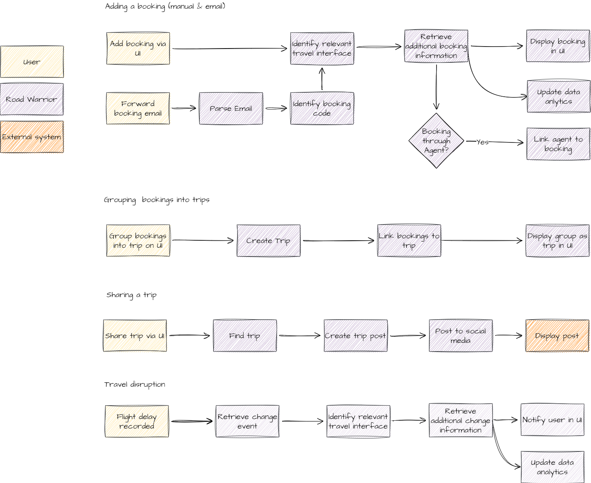

# Road Warrior by Flexibility Fertilizers

## Requirements
The architecture outlined below is based on the business case, requirements and user stories described in more detail [here](./Requirements/requirements-user-stories.md).

## System Overview

The below gives a high level view of the various systems and personas involved in interacting with Road Warrior

## Architectural Characteristics

Following the requirements and additional context, we assessed different architectural characteristics that are of main concern to the Road Warrior architecture.

| Characteristic |  Notes |
|--------|----|
| Availability | The system has strict downtime requirements of a maximum of 5 minutes a month. This is especially important for parts of the system that handle adding or updating travel details. |
| Reliability | The system must reliably accept travel updates from external travel agents and notify the user. Missing updates could impact the user's travel experience and have negative effects on user retention. |
| Elasticity  | Travel suffers from disruption in which case the system becomes even more important to its users wanting to keep on top of travel updates. In these instances, a surge in demand is expected and the system needs to be able to handle this gracefully and without impact to performance.
| Extensibility | The system integrates with various 3rd party travel and booking systems. Evolving with existing interfaces and adding new ones will be crucial to providing users the best possible set of details about their trips.  |

The following are characteristics that where considered relevant to the application but can be addressed through design and common practice.

| Characteristic |  Notes |
|--------|----|
| Installability | The system is accessible through a mobile app and website. To reach as many users as possible the app should be easy to install. This is well supported through different Application stores already.  |
| Privacy  | The system handles peoples' travel information which is personal and sensitive data. Identifiable data must therefore be kept private while an anonymized version must be accessible for data analytics. |
| Archivibility | The business model includes income to be derived from analytics run on user data. To make this successful, data needs to be retained and available to use for report creation. |

## Workflows

To identify the main components of the Road Warrior system, we looked at some of the main workflows it needs to support. Key roles that interact in these workflows are:

- **User** - The traveler interacting with the mobile or web app. They are interested in recording their bookings and keeping on top of their trips, before or during their travels. 
- **Travel systems** - A rich set of API Interfaces to external travel agencies and booking systems. These external systems host further details linked to booking codes. They are also aware of updates made to bookings as well as changes to itineraries caused by, for example, travel disruptions.
- **Social Media** - External systems allowing a user to connect to others and share their travel itineraries with them.

From the workflows we identified the following components that we wanted to explore further. We may discover the need for more as we investigate how they fit together and learn more about the use cases.

- Booking system - Handles users bookings and trips
- Travel system - Handles the communication with the various external travel and booking systems
- Email system - Entry point for User emails
- User system - Handles user related information
- Data analytics system - Handles processing of any user and travel data for data analytics

## Chosen architecture
Based on the identified characteristics and workflows RoadWarrior will adopt a microservice architecture in combination with event-driven when asynchronous communication is required. By keeping services of our system discrete we can make our system tolerant to faults and spikes in traffic. For example, a service-oriented architecture may have multiple containers communicate with the same database. If one container's traffic spikes it could potentially bring that database for other containers. Whereas a microservice architecture allows each container to function fully independently of other containers. 

This is important to RoadWarrior because the system will have times of increased load and we will want to ensure some parts of the system, like alerting, are kept operational. 

Care should be taken to ensure that a disproportionate amount of traffic does not go through one container. This would indicate a single point of failure and such containers may need broken up to distribute traffic. This increases our elasticity and fault tolerance. 

[Adr](./ADR/adr001-architecture-style.md)

## Zooming into Road Warrior

This diagram shows the interactions of the various parts of the Road Warrior system at a high level. It indicates the flow through the Road Warrior application rather than define the individual containers which are explored individually below:

1. [Booking system](./ContainerView/booking-system.md)
1. [Alerting](./ContainerView/alerting.md)
1. [Data analytics](./ContainerView/data-analytics.md)
1. [Email](./ContainerView/email-system.md)
1. [Travel system API](./ContainerView/travel-system-api.md)
1. [Social media](./ContainerView/social-media.md)
1. [Users](./ContainerView/user-system.md)

The sequence diagrams in the documents show the path through the system and also whether the request can be considered synchronous or asynchronous. It is expected that the sequence diagrams will be more ephemeral than the container diagrams. As the system is implemented and interactions are explored further they will be expanded and modified.

## Critical Infrastructure
We identified that availability, reliability and elasticity are specifically important to the alert system, travel system API and booking system. By ensuring these systems are design to withstand surges, users will be able to received notifications even during times of travel disruptions.

Other parts of the system such as the data analytics and social media integrations are not vital for keeping users up-to-date with ongoing travel issues.

The database technology that will be chosen needs to lend itself to horizontal scaling and distribution, as we require the data to be held in multiple data nodes.

[Link to ADR here]()

## Next Steps
While we have tried to keep the scope of the various systems quite narrow, there are a lot of requirements to cover that span a broad spectrum of technologies and engineering practices. There is a lot of front-end work, asynchronous events to handle, email protocols, data analytics concepts etc.

Instead of trying to build everything before making the system available, our recommendation would be to run a series of prototypes or perhaps a public alpha version that will help with getting real world feedback. This way we can measure if our predictions of architectural characteristics and business cases are correct without spending several months or years of development.

A simplified version of Road Warrior can be tried out by internal staff or perhaps a select group of volunteers to get a sense of what is important during inputting trips and while traveling.
