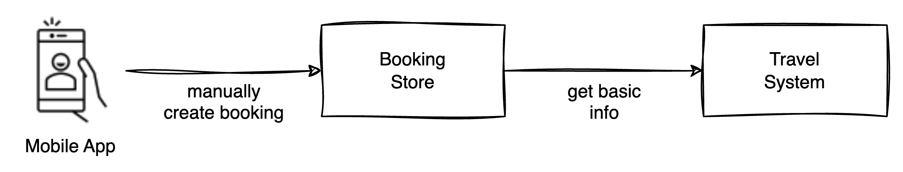

# Prototyping
While we have tried to keep the scope of the various systems quite narrow, there are a lot of requirements to cover that span a broad spectrum of technologies and engineering practices. There is a lot of front-end work, there asynchronous events to handle, email protocols, data analytics concepts etc.

Instead of trying to build everything before making the system available, our recommendation would be to run a series of prototypes or perhaps a public alpha version that will help with getting real world feedback. This way we can measure if our predictions of architectural characteristics and business cases are correct without spending several months or years of development.

A simplified version of Road Warrior can be tried out by internal staff or perhaps a select group of volunteers to get a sense of what is important during inputting trips and while traveling.